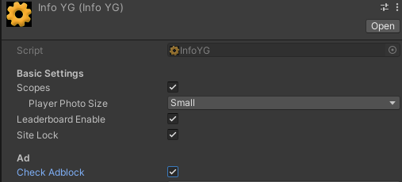

# РАЗРАБОТКА ИГРОВЫХ СЕРВИСОВ
Отчет по лабораторной работе #6 выполнил:
- Абзапаров Николай Дмитриевич
- РИ300012
### Ссылка на репозиторий с проектом: https://github.com/Abzaparov-Nikolay/DragonPicker

Отметка о выполнении заданий (заполняется студентом):

| Задание | Выполнение | Баллы |
| ------ | ------ | ------ |
| Задание 1 | * | 60 |
| Задание 2 | * | 20 |
| Задание 3 | * | 20 |

знак "*" - задание выполнено; знак "#" - задание не выполнено;

Работу проверили:
- к.т.н., доцент Денисов Д.В.
- к.э.н., доцент Панов М.А.
- ст. преп., Фадеев В.О.

## Цель работы
Создание интерактивного приложения с рейтинговой системой пользователя и интеграция игровых сервисов в готовое приложение.

## Задание 1
1. Заполнил данные об игре на 80 процентов и получил доступ на РСЯ
2. Создал блок рекламы для приложения
   
3. Сохранил рекламный блок в статическое поле
   
4. Подключил рекламные блоки, теперь они отображаются во время игры
   
5. Реализовал показ рекламы посреди игры
   
   ``` cs
   YandexGame.RewVideoShow(0);
   ```
6. Реализовал получение наград при просмотре рекламы
   ``` cs
    public void RewardAdWatcher(int id)
    {
        if(id == 1)
        {
            Debug.Log("Награда получена!");
        }
    }

    public void ShowAd()
    {
        YandexGame.RewVideoShow(1);
    }
   ```
   
7. Добавил первый товар во внутриигровой магазин
   
8. Добавил возможност покупки товара<br>
   
9.  Сделал проверку на использования неприятных аддонов браузеров
    
    ## Задание 2
1) Добавил на сцену сферу и текст, куда будет выводится статус онлайна игрока<br>
   
2)  При входе в игру проверяется статус игрока<br>
  

   
## Задание 3
1. На мой взгляд лучшей стратегией монетизации нашего приложения будет реализация покупки кастомизации на Дракона, яйца, модельку персонажа. Данная монетизация никак не затрагивает игровой процесс, что положительно сказывается на отзывах игроков.
2. Вторым по списку, я считаю, идет показ рекламы за вознаграждение, которые влияют на игровой процесс. Например, получение дополнительного щита, увеличение радиуса щита, замедление падения яиц. Такой способ является сложно настраиваемым, так как при повсеместном применении в приложении, пользователи могут посчитать, что игра разработана исключительно для показа рекламы. Требуется большая осторожность при применении такого подхода

# Выводы
Научился добавлять предметы во внутриигровой магазин, размещать рекламу в приложении и на сайте, обходить адблок при просмотре рекламы с вознаграждением. Осознал, что для поддержки приложения другимим разработчиками следует писать хороший код и создавать хорошую архитектуру приложения с самого начала работы над этими аспектами<br>
Приложении можно найти по ссылке: https://yandex.ru/games/app/198458?draft=true&lang=ru

## Powered by

**BigDigital Team: Denisov | Fadeev | Panov**
